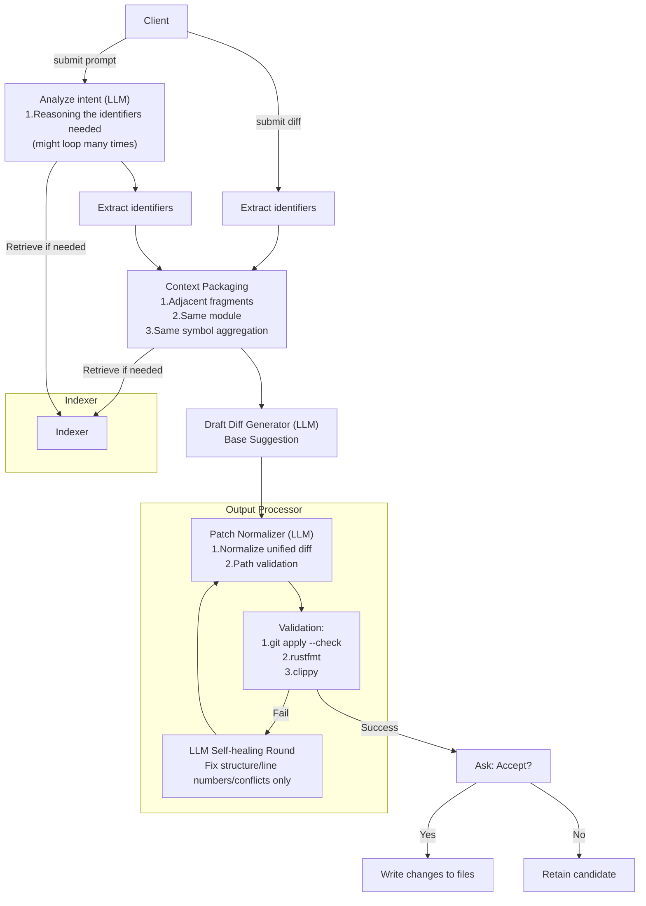

# Rust Copartner

Rust Copartner is a tool for suggesting changes to a Rust project.

## Usage

Rust Copartner works in two modes:

**Interactive**: Infers your intended changes based on your last modification and provides relevant suggestions.  
**Prompt**: Allows you to describe the desired changes and generates a complete diff across multiple files.

### Setup

Start the daemon:

```bash
python rust-copartner-daemon.py <project_dir> [options]
```

Daemon options:

- `-p, --port`: Port to run the server on (default: 9876)
- `--host`: Host to bind to (default: 0.0.0.0)
- `--mock`: Use mock LLM for development/testing
- `--reload`: Enable auto-reload for development

### Client Usage

**Interactive mode** - Send a diff:

```bash
python rust-copartner-client.py <diff_file> [options]
```

**Prompt mode** - Describe changes:

```bash
python rust-copartner-client.py --prompt "Make Point struct 3D" [options]
```

Client options:

- `-p, --port`: Port of the daemon server (default: 9876)
- `--host`: Host of the daemon server (default: localhost)
- `--json`: Output result in JSON format

## Example (Interactive Mode - Scene 1)

> You can find an example in the `e2e_tests/interactive/scene1` directory.

We can use the `rust-copartner-daemon.py` to start a daemon server to watch this project.

```bash
python rust-copartner-daemon.py e2e_tests/interactive/scene1/original
```

```rust
// e2e_tests/interactive/scene1/original/main.rs
#[derive(Debug, Clone, Copy, PartialEq)]
struct Point {
    x: i32,
    y: i32,
}

impl Point {
    fn new(x: i32, y: i32) -> Self {
        Self { x, y }
    }
}

fn main() {
    let p = Point::new(1, 2);
    println!("p = {:?}", p);
}

```

This is the diff between the original file and last change what the user made.

```diff
--- a/main.rs
+++ b/main.rs
@@ -1,5 +1,5 @@
 #[derive(Debug, Clone, Copy, PartialEq)]
-struct Point {
+struct Point3D {
     x: i32,
     y: i32,
 }

```

Execute the following command to ask suggestions:

```bash
python rust-copartner-client.py last_change.diff
```

Output the suggested change and ask if you want to accept it.

```diff
Suggest change:
--- a/main.rs
+++ b/main.rs
@@ -1,16 +1,17 @@
 #[derive(Debug, Clone, Copy, PartialEq)]
-struct Point {
+struct Point3D {
     x: i32,
     y: i32,
+    z: i32,
 }
 
-impl Point {
-    fn new(x: i32, y: i32) -> Self {
-        Self { x, y }
+impl Point3D {
+    fn new(x: i32, y: i32, z: i32) -> Self {
+        Self { x, y, z }
     }
 }
 
 fn main() {
-    let p = Point::new(1, 2);
+    let p = Point3D::new(1, 2, 3);
     println!("p = {:?}", p);
 }

Accept? (y/n): y
```

## Example (Prompt Mode - Scene 1)

> You can find an example in the `e2e_tests/prompt/scene1` directory.

Start the daemon with the same original project:

```bash
python rust-copartner-daemon.py e2e_tests/prompt/scene1/original
```

Instead of sending a diff, describe what you want:

```bash
python rust-copartner-client.py --prompt "Make Point struct 3D"
```

The LLM will analyze the project and generate a complete diff:

```diff
Suggested changes:
--- a/main.rs
+++ b/main.rs
@@ -1,16 +1,17 @@
 #[derive(Debug, Clone, Copy, PartialEq)]
-struct Point {
+struct Point3D {
     x: i32,
     y: i32,
+    z: i32,
 }
 
-impl Point {
-    fn new(x: i32, y: i32) -> Self {
-        Self { x, y }
+impl Point3D {
+    fn new(x: i32, y: i32, z: i32) -> Self {
+        Self { x, y, z }
     }
 }
 
 fn main() {
-    let p = Point::new(1, 2);
+    let p = Point3D::new(1, 2, 3);
     println!("p = {:?}", p);
 }

Accept? (y/n): y
```

## Demo (Mock mode)

[](https://asciinema.org/a/e3LX0yo8eM60qJ4WI54ypVjgr)

## Workflow (daemon)

### Common Setup

1. **Index Building**: Build/Update embedding index for the codebase to Qdrant.
    - (Next step) Uses Elasticsearch for BM25.
    - Qdrant Indexes:
      - id: hash(repo_id, path, qual_symbol)
      - vector:
        - signature: `struct`, `impl`, `fn`..., compacted string
        - identifiers: different identifiers in the code fragment, compacted string
        - code body: code body in the code fragment, without comments, compacted string
        - Doc comment: doc comment in the code fragment, compacted string
      - payload:
        - repo_id: string
        - path: string
        - kind: `struct`, `impl`, `fn`...
        - qual_symbol: "crate::point::Point::new"
        - start_line: int
        - end_line: int
        - text: code fragment text
2. **Embedding Query Generation**: Based on the `diff` or `prompt`
    - More details in below section.
3. **Context Retrieval**: Get top-K code fragments from indexes.
    - `Score` = a*`Embedding'` + b*`BM25'` + c*`Heuristic'` (a, b, c are weights)
    - `Embedding` = Search for the top 30 code fragments from Qdrant.
    - `BM25` = (Next step) Search for the top 30 code fragments from Elasticsearch.
    - `Heuristic` = (Next step) Use some rules to affect the ranking.
4. **Suggestion Generation**: Send top-K code fragments + the original file to LLM to generate a `base suggestion diff`.
5. **Output Processing**: Send the "base suggestion diff" together with the original file to the LLM, and generate an **applicable suggestion diff**.
6. **Validation & Acceptance**: Use `git apply --check` to validate the diff.
    - (Next step) Check by `rustfmt` and `clippy` first.
    - If valid, ask the user if they want to accept all changes.

### Query Embedding Generation

- Interactive Mode
  1. **Diff Generation**: Generate a diff file between the user change and the original file (`last_change.diff`).
  2. **Query Embedding**: Generate a query embedding for the diff file.
      - Take the identifiers directly in the changed lines.
      - Embed the query by `fastembed` (low cost).
- Prompt Mode
  1. **Prompt Processing**: Parse the natural language prompt from the user.
  2. **Intent Analysis**: Generate query embedding for the prompt description.
      - Extract key identifiers and concepts from the prompt.
      - Embed the prompt by `fastembed` (low cost).

## Architecture (Draft)


### Watch project changes (Daemon)


### LangChain workflow (Daemon)



## Indexer

### Indexing (TODO)

- Supports upsert index
- Supports delete index
- Extracts identifiers, code body, doc comment from the code fragment by `syn` or other parsers

### Retrieval


